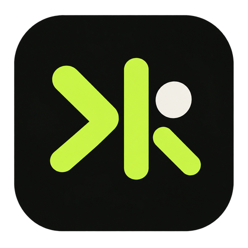

<p align="center">
  
</p>

<h1 align="center">Kern Studio</h1>

<p align="center">
  A local-first AI developer workspace for running the
  <a href="https://github.com/badlogic/pi-mono">pi coding agent</a>
  across local projects.
</p>

Kern Studio brings project discovery, isolated task worktrees, native agent chat, local Deep Research, code review, Graphify context, Kanban tracking, and delivery-pipeline visibility into one focused desktop application.

## Workspace

- **Agent sessions** — run project-aware and global conversations from one desktop workspace.
- **Isolated work** — keep task changes separated in dedicated Git worktrees.
- **Review and delivery** — inspect diffs, monitor pipelines, and follow work through Kanban.
- **Local knowledge** — use Graphify and RAG context without duplicating project state in the cloud.
- **Deep Research** — create source-backed reports in a restricted, project-independent session.

## Deep Research

The global **Deep Research** dashboard runs one dedicated Pi session with only `web_search`, `source_check`, `fetch_content`, and `get_search_content`. It cannot read projects, run shell commands, or mutate files. Progress, partial Markdown, source metadata, and completed reports are stored locally under the app's Application Support directory; queries and reports may contain sensitive information. Cancellation retains partial work. Runs interrupted by an app/process restart can resume from the exact Pi session when available, otherwise from a disclosed bounded checkpoint.

## Stack

- Tauri 2
- React 19 + TypeScript
- Vite 7
- Rust

## Requirements

- macOS on Apple Silicon
- Node.js 22+
- Rust toolchain
- `pi` CLI
- `git`
- `graphify` (optional, for knowledge graphs)

## Development

```bash
pnpm install
pnpm tauri dev
# or frontend only
pnpm dev
```

## Checks

```bash
pnpm test
pnpm run check:version  # cargo/tauri conf ↔ package.json sync
pnpm build              # check:version + tsc + vite build
```

## Scripts

- `dev` — Vite dev server
- `test` — vitest run (jsdom)
- `check:version` — version sync gate
- `build` — gate + typecheck + bundle
- `preview` — serve build
- `tauri` — Tauri CLI proxy (`pnpm tauri dev/build`)

## Documentation

- [Product requirements](docs/PRD.md)
- [Project context and glossary](CONTEXT.md)
- [Architecture decisions](docs/adr/)

## Status

Under active development for a single-user, local-first workflow.

> The internal package name, bundle identifier, Application Support paths, and updater endpoint still use `command-rdev-center` for compatibility with existing installations.
