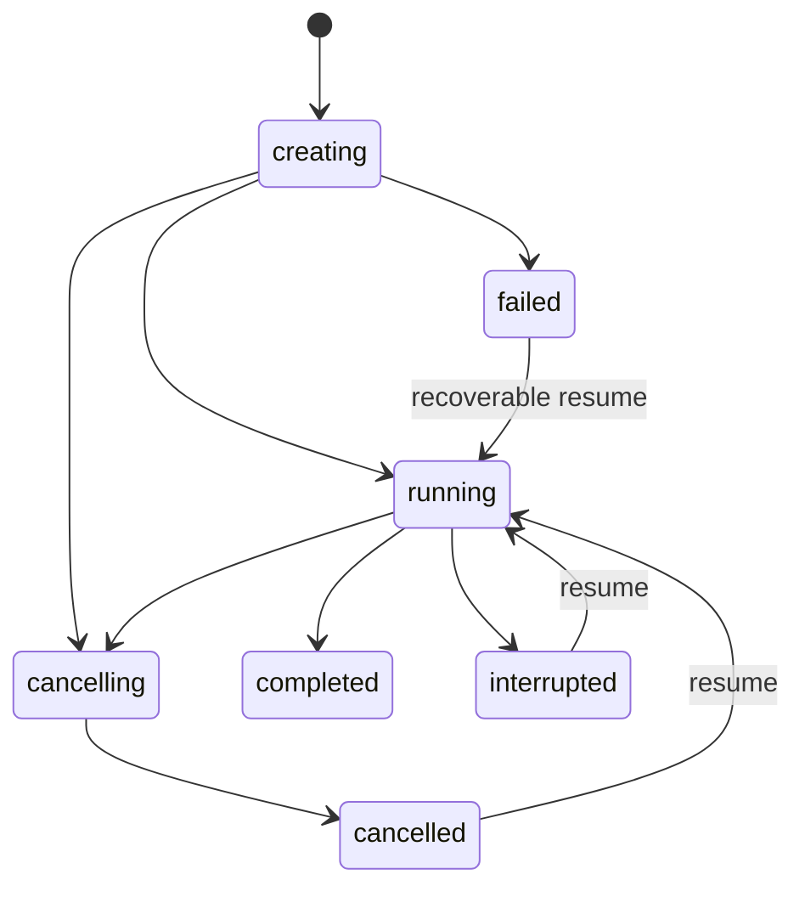
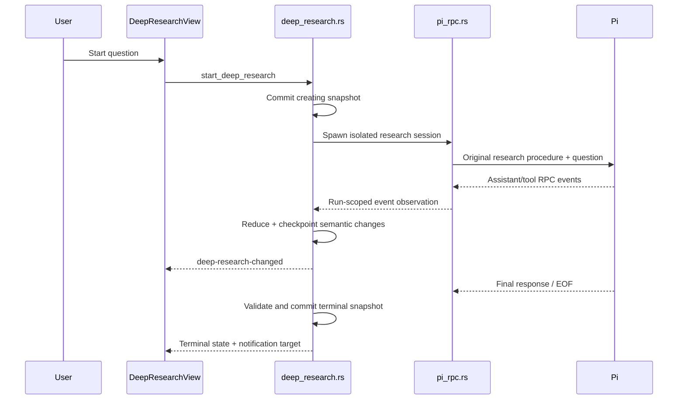
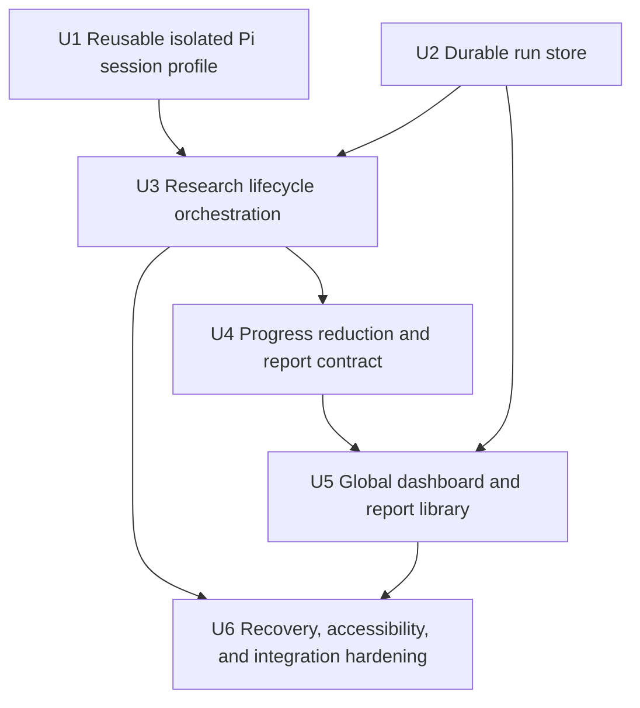
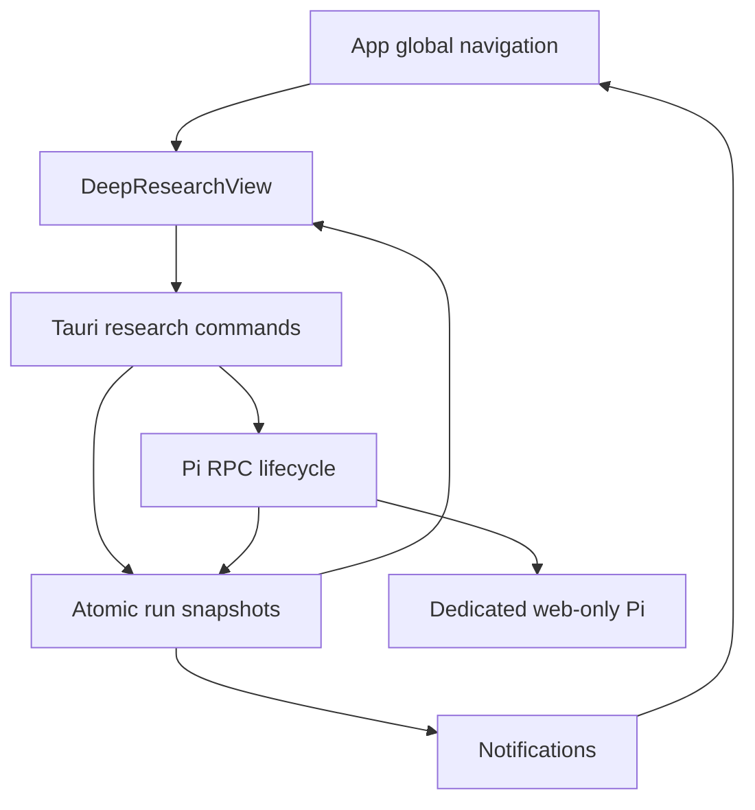

# feat: Add native Deep Research

## Overview

Add a global, project-independent Deep Research workspace that runs a dedicated, web-only Pi RPC session, exposes structured progress, preserves partial work, and stores completed cited Markdown reports locally.

The implementation is independent. It reuses command-rdev-center's existing Pi RPC, local persistence, dashboard, notification, Markdown, and web-tool patterns. It does not copy Odysseus source, tests, prompts, assets, text, schemas, or dependencies.

---

## Problem Frame

Normal chat can invoke web tools, but it does not provide a durable research-job lifecycle. Long investigations need a focused entry point, visible phases, cancellation, recovery after process/app failure, and a report library that survives restart.

The smallest useful design keeps Pi as the research engine and session authority. The app adds only orchestration, safe tool boundaries, durable run metadata, recovery, and presentation. It does not create a second LLM/search engine in Rust.

---

## Requirements Trace

- **R1.** A user can start a global Deep Research run from a dedicated dashboard using a non-empty question.
- **R2.** Each run uses a dedicated Pi RPC session with exactly `web_search`, `source_check`, `fetch_content`, and `get_search_content`; it receives no project context, extensions, shell, or file mutation tools.
- **R3.** The dashboard shows qualitative phases, current activity, completed tool counts, source count, and partial output without fabricated percentages or ETAs.
- **R4.** A user can cancel a run idempotently; cancellation retains the latest durable partial report and source metadata.
- **R5.** Run snapshots and final reports survive app restart. Previously active runs reconcile to `interrupted` and can resume.
- **R6.** Resume prefers the exact Pi session file and falls back to a fresh session grounded by the checkpoint when that file is unavailable.
- **R7.** Completion requires a non-empty Markdown report and structured sources. Reports and source links remain viewable without spawning Pi.
- **R8.** Failures are explicit and preserve useful work. Corruption in one run must not prevent other history from loading.
- **R9.** The first release permits one active Deep Research run globally to bound model, provider, and process usage.
- **R10.** The implementation follows the existing design system and accessibility rules: keyboard operation, visible focus, textual state, restrained live announcements, reduced-motion support.
- **R11.** No Odysseus implementation artifact is copied or added as a dependency.

---

## Scope Boundaries

- No custom search crawler, ranking engine, claim graph, or second LLM orchestration engine in Rust.
- No project files, Graphify context, RAG corpus, Kanban, pipeline, shell, or write tools inside research sessions.
- No multiple simultaneous runs, scheduler, multi-agent fan-out, PDF/HTML export, editable reports, or cloud synchronization in v1.
- No fake progress percentage or ETA derived from unconstrained agent work.
- No persistence of raw fetched page bodies, provider credentials, headers, or complete raw RPC payloads.
- No automatic deletion or retention cap for completed reports in v1.

### Deferred to Follow-Up Work

- Bounded parallel runs or queueing: add only after real demand and resource measurements.
- Citation graph and claim-level validation: add if prompt/tool-backed citation validation proves insufficient.
- Report export and history search/filtering: add when report volume justifies them.
- Scheduled research and project-grounded research: separate features with different safety boundaries.

---

## Context & Research

### Relevant Code and Patterns

- `src-tauri/src/pi_rpc.rs`: Pi child-process registry, exact-session resume, JSONL framing, Tauri event bridge, cancellation, global app-owned cwd, and existing four-tool web-only allowlist.
- `src/components/ChatView.tsx`: raw RPC event reduction, streaming assistant output, tool-call correlation, failure handling, notifications, and background-mounted sessions.
- `src/components/ToolCall.tsx`: existing web-search tool recognition and progress/result presentation.
- `src/lib/rpc.ts`: shared RPC and tool-call types.
- `src-tauri/src/pipeline.rs`: current/history lifecycle, cancellation vocabulary, local history, and terminal records.
- `src-tauri/src/kanban.rs`: stronger atomic-write pattern using same-directory temporary files, sync, backup, rename, and directory sync.
- `src/App.tsx`: lazy global dashboards, sidebar navigation, notifications, and active-view routing.
- `src/components/PipelineView.tsx`: active/history dashboard polling and hidden-document behavior.
- `src/components/MarkdownMessage.tsx`: safe GFM rendering and external links.
- `src/components/useModalFocus.ts`: accessible confirmation/dialog focus handling.
- `DESIGN.md`: Agent Operations Console design rules, Search Cyan, state redundancy, focus, density, and reduced motion.
- `docs/adr/0001-chat-worktree-ephemeral-session-pi-default.md`: Pi session file remains the durable conversation authority.
- `docs/adr/0002-pi-parity-rpc-tui-only-gaps.md`: build product coordination around RPC capabilities instead of duplicating Pi.

### Institutional Learnings

`docs/solutions/` currently contains no relevant learning documents. Existing ADRs and task records establish that Pi owns session continuity, background views must keep explicit stopped/error states, and run-scoped actions need stable identity and idempotent terminal transitions.

### External Reference

- Odysseus Deep Research was used only as product/architecture inspiration: <https://github.com/odysseus-dev/odysseus>. No implementation artifacts will be copied.

---

## Key Technical Decisions

| Decision | Choice | Rationale |
|---|---|---|
| Research engine | Dedicated Pi RPC session | Reuses installed models, web tools, sessions, streaming, and auth; avoids a second engine. |
| Safety boundary | Exact four-tool allowlist in app-owned global cwd | Existing proven isolation; prevents project and local-machine mutation access. |
| Active concurrency | One run globally | Smallest safe v1; bounds process, token, provider, and rate-limit usage. |
| Progress | Qualitative phases and counters | RPC tool events cannot truthfully predict total completion. |
| Persistence | One versioned atomic snapshot per run | Isolates corruption and keeps metadata/report/source state semantically consistent. |
| Session transcript | Pi session file | Avoids duplicating Pi conversation history; app snapshot stores only job metadata and recoverable artifacts. |
| Recovery | Exact session first, checkpoint-grounded fresh session second | Preserves continuity without making a missing transcript destroy useful work. |
| Terminal races | First atomically committed terminal state wins | Prevents completed/cancelled contradictions and duplicate notifications. |
| UI updates | Tauri run-change events plus load/reconcile command | Events provide immediacy; durable snapshots recover events missed while the view was closed. |
| Source storage | Metadata only, with original URL and canonical dedupe key | Supports report transparency/resume without retaining fetched bodies. |

---

## Canonical State Model

| State | Meaning | User actions |
|---|---|---|
| `creating` | Initial snapshot exists; Pi is not ready yet | Cancel |
| `running` | Pi session is active | Open, Cancel |
| `cancelling` | Terminal cancellation is being settled | Open |
| `interrupted` | Process/app ended without committed completion | Open partial, Resume, Start new |
| `completed` | Valid final report and sources committed | Open, Start new |
| `cancelled` | User stopped the run; partial artifacts retained | Open partial, Resume, Start new |
| `failed` | Unrecoverable operation failed; artifacts may exist | Open partial, Resume when eligible, Start new |

`resuming` is represented as a guarded transition operation, not a durable long-lived state. A successful claim commits `running`; a failed claim leaves the prior terminal state with an updated error. On startup, stale `creating` becomes `failed`, stale `running` becomes `interrupted`, and stale `cancelling` becomes `cancelled` because app-owned children do not survive as attachable sessions.



---

## High-Level Technical Design

> *This illustrates the intended approach and is directional guidance for review, not implementation specification. The implementing agent should treat it as context, not code to reproduce.*



The research procedure should be an original, app-owned prompt that asks Pi to:

1. establish sub-questions and success criteria;
2. run 2–4 diverse searches per round;
3. fetch the strongest sources;
4. check high-impact claims with `source_check`;
5. inspect gaps and continue only when useful, under a bounded turn/time budget;
6. produce a Markdown report with an executive summary, findings, caveats, conclusion, and resolvable citations.

Progress is inferred idempotently from correlated tool calls. `web_search` maps to Searching, `fetch_content`/`get_search_content` to Reading sources, `source_check` to Verifying claims, and final assistant output to Synthesizing/Finalizing. Unknown events remain safe generic activity.

---

## Output Structure

```text
src-tauri/src/
  deep_research.rs
src/components/
  DeepResearchView.tsx
  DeepResearchView.test.tsx
src/lib/
  deep-research.ts
  deep-research.test.ts
docs/plans/
  2026-08-04-001-feat-deep-research-plan.md
```

Runtime data is app-owned, not repository content:

```text
Application Support/command-rdev-center/deep-research/
  runs/<run-id>.json
```

Pi continues to own its session transcript in the configured Pi session directory. The snapshot records the exact session file path after Pi reports it.

---

## Implementation Unit Dependencies



---

## Implementation Units

- [ ] U1. **Extract a reusable isolated Pi session profile**

**Goal:** Allow internal callers to spawn a web-only research session without changing existing chat behavior or duplicating the Pi subprocess implementation.

**Requirements:** R2, R6, R11

**Dependencies:** None

**Files:**
- Modify: `src-tauri/src/pi_rpc.rs`
- Test: `src-tauri/src/pi_rpc.rs`

**Approach:**
- Extract the configurable internals of `spawn_pi_rpc` behind an internal session profile/configuration boundary.
- Preserve the existing Tauri command contract for chat.
- Define a research profile using the app-owned global cwd, exact four-tool allowlist, no project extensions/system context, optional exact session file, and a run-event observer.
- Research spawning must reject a live duplicate ID rather than inheriting chat's replace-and-kill behavior.
- Expose process termination/liveness internally without exposing a new frontend-general subprocess API.

**Patterns to follow:**
- `spawn_pi_rpc`, `session_args`, `global_chat_cwd`, `SESSIONS`, and LF-only reader tests in `src-tauri/src/pi_rpc.rs`.

**Test scenarios:**
- Happy path: research profile builds exactly the four approved tools and no project extensions.
- Integration: existing project and global-chat spawn arguments remain unchanged after refactor.
- Edge case: exact session file is retained for research resume.
- Error path: duplicate live research session ID is rejected without terminating the original process.
- Isolation: no `bash`, `read`, `write`, `edit`, Graphify, Kanban, or pipeline capability reaches the research profile.

**Verification:**
- Existing Pi RPC tests pass unchanged; profile tests prove the narrower research boundary and duplicate protection.

---

- [ ] U2. **Add the durable research run store**

**Goal:** Persist one authoritative, recoverable snapshot per run without adding a database or second transcript store.

**Requirements:** R4, R5, R7, R8, R9

**Dependencies:** None

**Files:**
- Create: `src-tauri/src/deep_research.rs`
- Modify: `src-tauri/src/lib.rs`
- Test: `src-tauri/src/deep_research.rs`

**Approach:**
- Define a versioned run snapshot containing immutable query/settings, state, monotonic generation, timestamps, RPC/session identity, progress summary, bounded partial/final report, normalized source metadata, cancellation intent, resume count, and bounded error classification.
- Use one file per run; derive dashboard ordering from snapshots rather than maintaining a second mutable index.
- Follow the strong atomic-write pattern: same-directory unique temp file, flush/sync, backup, rename, parent-directory sync.
- Load valid runs independently. Recover from `.bak` where safe; one corrupt run produces a warning without blocking all history.
- Do not persist raw page bodies, credentials, headers, or complete RPC payloads.
- Add startup reconciliation for stale nonterminal states.

**Patterns to follow:**
- Atomic writes in `src-tauri/src/kanban.rs`.
- Current/history reading and terminal-state handling in `src-tauri/src/pipeline.rs`.

**Test scenarios:**
- Happy path: create, update, complete, reload, and sort snapshots deterministically.
- Crash safety: interrupted temp/rename leaves either the previous or next valid snapshot.
- Recovery: corrupt primary loads valid backup and surfaces a bounded warning.
- Isolation: one corrupt run does not hide valid runs.
- Reconciliation: stale `running`, `creating`, and `cancelling` resolve to their specified states; terminal runs remain unchanged.
- Privacy: serialized snapshots omit raw fetched content and raw RPC payloads.
- History: no silent retention cap deletes completed reports.

**Verification:**
- Restart simulation reconstructs all valid history and preserves partial artifacts with deterministic states.

---

- [ ] U3. **Implement start, cancel, and resume orchestration**

**Goal:** Own the run lifecycle around dedicated Pi sessions with one active run, safe terminal races, and partial preservation.

**Requirements:** R1, R2, R4, R5, R6, R8, R9

**Dependencies:** U1, U2

**Files:**
- Modify: `src-tauri/src/deep_research.rs`
- Modify: `src-tauri/src/lib.rs`
- Test: `src-tauri/src/deep_research.rs`

**Approach:**
- Register narrow Tauri commands for start, list/detail data, cancel, and resume.
- Validate and checkpoint before spawning. If spawn or initial command fails, stop any child and commit an actionable state.
- Maintain one guarded active run. Double start/resume must not create a second process.
- Mark cancellation intent before process termination; first committed terminal state wins if completion races cancellation.
- Preserve partial content on every terminal path.
- Resume claims the run atomically. Prefer its exact Pi session; otherwise start a fresh isolated session with the original query plus bounded checkpoint/source context and label the recovery mode.
- Use an original research procedure and bounded runtime/turn policy. Do not use Odysseus prompts or wording.
- Emit a run-scoped Tauri change event only after the corresponding semantic snapshot is committed.

**Patterns to follow:**
- `start_pipeline`, `cancel_pipeline`, active-run guards, and terminal history semantics in `src-tauri/src/pipeline.rs`.
- `spawn_pi_rpc`, `send_pi_command`, `kill_pi_session`, and exact session resume in `src-tauri/src/pi_rpc.rs`.

**Test scenarios:**
- Happy path: valid query creates one checkpoint, one process, and reaches `running`.
- Validation: blank query creates neither file nor process.
- Concurrency: second start or double resume is rejected while one run is active.
- Error path: spawn failure and prompt-send failure terminate cleanly and preserve actionable state.
- Cancellation: repeated cancel is idempotent and retains partial artifacts.
- Race: completion versus cancellation commits exactly one terminal state.
- Restart: active persisted run becomes resumable `interrupted`.
- Resume: exact session is preferred; missing session uses checkpoint recovery without duplicating sources.
- Storage failure: after one bounded retry, the run stops safely rather than falsely claiming durable progress.

**Verification:**
- Every command leaves a valid snapshot and no hidden process; all terminal transitions are deterministic and idempotent.

---

- [ ] U4. **Reduce RPC events into progress and validated reports**

**Goal:** Convert existing Pi events into durable qualitative progress, partial output, sources, and a valid final report without a parallel event protocol.

**Requirements:** R3, R5, R7, R8

**Dependencies:** U3

**Files:**
- Create: `src/lib/deep-research.ts`
- Create: `src/lib/deep-research.test.ts`
- Modify: `src-tauri/src/deep_research.rs`
- Test: `src-tauri/src/deep_research.rs`

**Approach:**
- Define shared serializable run/progress/source shapes and a pure idempotent reducer keyed by tool `callId`.
- Map known tools to qualitative phases; track completed searches, reads, checks, and unique sources.
- Unknown/malformed events must not fail the run. Unfinished tools become interrupted when RPC ends.
- Debounce assistant partial-output checkpoints and persist semantic tool transitions, not every token.
- Normalize URLs for dedupe while retaining original URLs. Distinguish cited from consulted sources where the available tool result supports it.
- Require non-empty final Markdown and structured source metadata before committing `completed`. Unresolved explicit citations produce a visible partial/failed result rather than silent success.
- Commit the final snapshot before emitting completion or notification events.

**Patterns to follow:**
- `upsertToolCall`, streamed output bounding, and RPC parsing in `src/components/ChatView.tsx`.
- `isWebSearchTool` and normalized tool results in `src/components/ToolCall.tsx`.
- Types in `src/lib/rpc.ts`.

**Test scenarios:**
- Happy path: tool start/delta/end updates phase, activity, counters, and source records.
- Idempotency: duplicate and out-of-order tool events do not double-count or regress terminal tools.
- Resilience: unknown/malformed events are ignored safely.
- Interruption: active tools and partial assistant output remain visible after EOF/error.
- Streaming: final output does not duplicate accumulated deltas.
- URL handling: tracking/fragment variants dedupe while original provenance remains.
- Validation: empty report or broken source references cannot become `completed`.
- Performance: high-volume deltas result in bounded/debounced persistence work.

**Verification:**
- A captured representative RPC sequence deterministically produces the same progress and final snapshot when replayed more than once.

---

- [ ] U5. **Build the global dashboard and report library**

**Goal:** Provide start, active progress, cancellation, recovery actions, history, and safe report reading in the existing operations-console UI.

**Requirements:** R1, R3, R4, R5, R6, R7, R10

**Dependencies:** U2, U4

**Files:**
- Create: `src/components/DeepResearchView.tsx`
- Create: `src/components/DeepResearchView.test.tsx`
- Modify: `src/App.tsx`
- Modify: `src/App.css`
- Modify: `src/application-redesign.css`
- Test: `src/components/DeepResearchView.test.tsx`

**Approach:**
- Add lazy global dashboard navigation independent of selected project.
- Show one compact composer, active run first, then newest historical runs.
- Render phase, textual status, current activity, counts, elapsed time, partial/final report, and source list. Reuse `MarkdownMessage`; do not create a second Markdown renderer.
- Use Search Cyan for search activity and Runtime Lime only for actions/live state per `DESIGN.md`.
- Confirm cancellation using the existing modal-focus pattern and state clearly that partial work is retained.
- Offer Resume only for eligible interrupted/cancelled/failed runs, plus Start new for all terminal runs.
- Subscribe to run-change events while visible and reconcile from backend state on mount, focus, and visibility return. Execution remains backend-owned when the dashboard unmounts.
- Reuse the existing notification plugin; completion/actionable interruption opens the exact run.

**Patterns to follow:**
- Dashboard navigation/lazy loading in `src/App.tsx`.
- Active/history layout and polling lifecycle in `src/components/PipelineView.tsx`.
- `MarkdownMessage`, `ToolCallView`, `useModalFocus`, and existing notification routing.
- `DESIGN.md` density, focus, state redundancy, and reduced-motion rules.

**Test scenarios:**
- Happy path: submit a valid question, observe active state, then open completed report and sources.
- Validation: empty query shows inline error and does not invoke start.
- Background: switching dashboards and returning restores current progress.
- Cancellation: decline changes nothing; accept shows cancelling/cancelled and retains partial report.
- Recovery: interrupted run exposes Resume; completed run does not.
- History: active run is first, completed runs sort newest-first, and one corrupt-run warning does not hide valid history.
- Accessibility: start/open/cancel/confirm/resume/source navigation work by keyboard; status uses text and restrained `aria-live`; focus returns correctly.
- Safety: report HTML does not execute and external links use the existing safe behavior.
- Notification: selecting a terminal notification opens the matching run detail.

**Verification:**
- The complete lifecycle is usable without chat or project selection and remains understandable without relying on color or animation.

---

- [ ] U6. **Harden recovery and cross-layer integration**

**Goal:** Prove lifecycle behavior across process errors, app restart, stale events, storage failures, and UI reconciliation.

**Requirements:** R4, R5, R6, R8, R9, R10, R11

**Dependencies:** U3, U5

**Files:**
- Modify: `src-tauri/src/deep_research.rs`
- Modify: `src-tauri/src/pi_rpc.rs`
- Modify: `src/components/DeepResearchView.test.tsx`
- Modify: `src/lib/deep-research.test.ts`
- Test: `src-tauri/src/deep_research.rs`
- Test: `src/components/DeepResearchView.test.tsx`
- Test: `src/lib/deep-research.test.ts`

**Approach:**
- Add startup reconciliation, terminal-event ordering guards, event generation checks, bounded error taxonomy, and safe stale-event rejection.
- Ensure app-owned child-process expectations are explicit: no promise of live process reattachment after app restart.
- Verify session/run IDs cannot collide with chat IDs and events from one run cannot mutate another.
- Add a provenance review checklist confirming independent implementation and no Odysseus artifacts.
- Keep this unit focused on behavior discovered at integration seams; do not add queueing, a generic job framework, or speculative abstractions.

**Patterns to follow:**
- Error/EOF handling in `ChatView.tsx` and `pi_rpc.rs`.
- Terminal-state and cancellation behavior in `pipeline.rs`.

**Test scenarios:**
- Integration: app restart during running, creating, and cancelling reconciles deterministically.
- Integration: EOF/error before completion preserves partial work and offers Resume.
- Race: stale events after resume or terminal commit cannot overwrite newer generations.
- Isolation: event for run A never mutates run B; research IDs never collide with chat IDs.
- Failure: disk-full/checkpoint failure cannot produce a false recoverability claim.
- Recovery: corrupt newest snapshot uses backup; missing Pi session uses disclosed checkpoint recovery.
- Accessibility: terminal/error transitions announce once rather than streaming delta spam.
- Provenance: diff/dependency review finds no copied Odysseus code, prompts, tests, assets, text, or package.

**Verification:**
- Frontend and Rust suites cover the highest-risk cross-layer transitions; app build succeeds with no new dependency.

---

## System-Wide Impact



- **Interaction graph:** `App.tsx` opens the dashboard; Tauri commands own lifecycle; `pi_rpc.rs` owns process transport; `deep_research.rs` owns reduction/persistence; run-change events and notifications route users back to a run.
- **Error propagation:** Validation remains inline. Launch/provider/agent/storage/corruption errors become bounded typed run errors with only context-safe actions. Raw stderr and credentials never enter report history.
- **State lifecycle risks:** Duplicate starts, cancel/completion races, stale RPC events, high-frequency writes, app restarts, missing session files, corrupt snapshots, and disk failure require explicit guards and tests.
- **API surface parity:** This is a user-facing dashboard feature. Agent-native start/manage tools are intentionally deferred until the lifecycle is stable; v1 must not expose a generic subprocess surface.
- **Integration coverage:** Process spawn plus prompt send plus checkpoint; RPC event plus reducer plus disk plus UI; cancel plus process exit plus terminal persistence; restart plus reconciliation plus resume.
- **Unchanged invariants:** Existing chat Tauri commands, Pi event names, project/global chat behavior, project isolation, pipeline lifecycle, and Markdown safety remain compatible.

---

## Risks & Dependencies

| Risk | Mitigation |
|---|---|
| Research quality varies by model/provider | Keep orchestration procedural, expose model choice using existing Pi settings where practical, and report tool/provider failures explicitly. |
| Tool events do not encode total work | Use phases and counts only; no percentage or ETA. |
| Duplicate or stale events corrupt progress | Correlate by call ID and snapshot generation; reducers are idempotent. |
| Frequent token deltas cause disk churn | Persist semantic transitions and debounced bounded report checkpoints. |
| App restart loses process ownership | Treat active snapshots as interrupted; resume from exact Pi session/checkpoint rather than promising reattachment. |
| Cancel races completion | Mark intent first; first atomic terminal commit wins. |
| Local history stores sensitive queries | Store minimal metadata/report/source records only; document local persistence and avoid raw bodies/events. |
| Citation/source mismatch | Validate report/source contract before completion; otherwise retain partial status with reason. |
| Provider quota/resource exhaustion | One active global run in v1 with bounded time/turn policy. |
| `pi_rpc.rs` refactor breaks chat | Preserve command contract and add argument/profile characterization tests before lifecycle work. |
| Inspiration creates license/provenance risk | Independent design and wording; explicit final review against R11. |

---

## Success Metrics

- A research run can start, continue while its view is closed, complete, and reopen after app restart.
- Cancellation and unexpected process exit retain the latest useful report/source checkpoint.
- Resume never silently kills another live run and can recover when the exact Pi session file is missing.
- Completed reports contain non-empty Markdown and a resolvable structured source list.
- Existing chat, project isolation, pipeline, and Pi RPC tests remain green.
- No new dependency or Odysseus implementation artifact is introduced.

---

## Open Questions

### Resolved During Planning

- **Use a custom Rust research engine?** No. Pi remains the engine; Rust coordinates lifecycle and persistence.
- **How many runs concurrently?** One active run globally in v1.
- **Can processes survive and reattach after app restart?** Not promised. Persisted active runs reconcile to interrupted and resume through Pi sessions/checkpoints.
- **Which tools are available?** Exactly the existing four web tools.
- **What progress is shown?** Qualitative phases, activity, counters, and sources; no percentage/ETA.
- **Does cancellation discard output?** No. Latest durable partial artifacts remain.
- **What if exact Pi resume is unavailable?** Continue from a bounded checkpoint in a fresh isolated session with recovery disclosure.
- **What does independent implementation exclude?** Odysseus source, tests, prompts, assets, text, schemas, and dependencies.

### Deferred to Implementation

- Exact Pi RPC event field names used to discover the session file and final response: verify against representative runtime events while preserving raw-event forward compatibility.
- Exact citation notation for the original research prompt: choose the smallest format that can be validated against structured source metadata.
- Exact canonical URL normalization: start with conservative fragment/tracking removal; avoid merging distinct documents.
- Exact bounded turn/time defaults: use existing Pi/session settings where available and tune from actual local-provider behavior.

---

## Documentation / Operational Notes

- Add user-facing documentation after implementation describing local storage, web-only isolation, cancellation, partial reports, and resume behavior.
- Research history is local to the machine and may contain sensitive query/report content.
- No migration is needed. The versioned snapshot reader must tolerate an empty directory and future schema versions safely.
- After implementation, update Graphify incrementally because new Rust/React modules alter the project graph.
- Capture the completed architecture under `docs/solutions/` once runtime behavior is verified; current knowledge is distributed across ADRs and source patterns.

---

## Sources & References

- Related code: `src-tauri/src/pi_rpc.rs`
- Related code: `src-tauri/src/pipeline.rs`
- Related code: `src-tauri/src/kanban.rs`
- Related code: `src/components/ChatView.tsx`
- Related code: `src/components/ToolCall.tsx`
- Related code: `src/components/PipelineView.tsx`
- Related code: `src/components/MarkdownMessage.tsx`
- Product design: `DESIGN.md`
- Architecture: `docs/adr/0001-chat-worktree-ephemeral-session-pi-default.md`
- Architecture: `docs/adr/0002-pi-parity-rpc-tui-only-gaps.md`
- External inspiration only: <https://github.com/odysseus-dev/odysseus>
