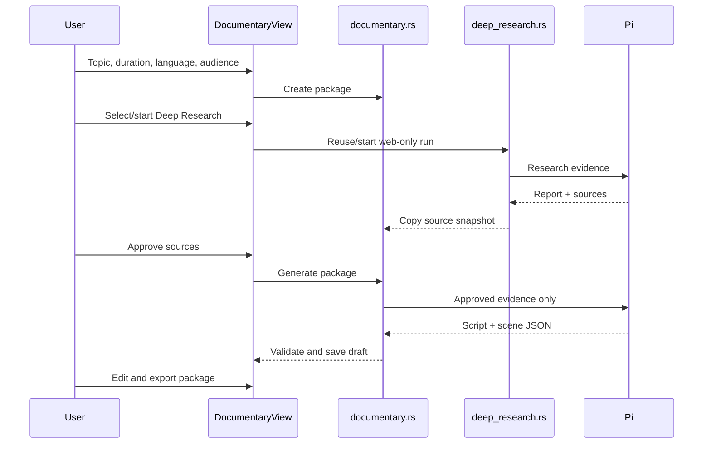

# feat: Add researched documentary production package

## Overview

Build the smallest useful bridge from Deep Research to a human-editable documentary plan.

**Phase 1 ships first:** a vertical 30–60 second reel production package: cited research, approved sources, voice-over script, six-beat storyboard, and an explicit manual asset checklist. No Remotion dependency, rendering, asset copying, or timeline editor yet.

```text
Topic
  → Deep Research
  → source approval
  → cited script
  → six-scene storyboard + asset checklist
  → export JSON / Markdown
```

This validates the useful product question: can a user turn trustworthy research into a production-ready brief without manually assembling the research, script, and visual requirements?

Remotion follows only after users successfully use the package.

## Problem Frame

Deep Research currently creates durable cited reports, but a creator still has to manually extract a story, identify visual beats, determine assets, and translate it into a video project. The app should make that pre-production work structured and reviewable.

It must not pretend to be a fully autonomous editor. AI proposes source-grounded content; the user approves evidence, edits prose, and supplies licensed assets.

## Requirements Trace

### Phase 1 — production package

- **R1.** User creates a documentary brief from a topic, language, audience, and a fixed **vertical reel** duration: 30, 45, or 60 seconds.
- **R2.** The brief reuses an existing completed Deep Research run or starts one purpose-built web-only research run.
- **R3.** User approves/rejects research sources before package generation.
- **R4.** The script has a short hook and exactly 5–8 ordered voice-over beats; factual claims point to approved source IDs or are marked `uncertain`.
- **R5.** Every beat includes on-screen text, emotional intent, visual concept, one restrained animation suggestion, and a manual asset checklist.
- **R6.** Checklist rows identify asset kind, description, orientation, minimum resolution, required/optional status, intended scene function, and a user-facing rights reminder.
- **R7.** User can edit generated script/storyboard/checklist fields before export. Edits do not delete claim provenance.
- **R8.** User can export a portable package: `research.md`, `sources.json`, `script.md`, `scenes.json`, and `asset-checklist.md`.
- **R9.** Package state survives restart and is recoverable independently from the Pi transcript.

### Phase 2 — fixed Remotion renderer, only after Phase 1 validation

- One fixed vertical composition: 1080×1920, 30 fps.
- User maps local assets to checklist rows by file path; missing assets show explicit draft placeholders.
- Preview and render one MP4 from a fixed, generic `Scene` component and JSON manifest.
- One local render at a time, no cloud or generative-video provider.

### Phase 3 — lightweight human editor, only after Phase 2 validation

- Scene reorder/duration; asset drag/drop; transform/crop/layer order.
- Text and fixed animation cue settings; audio/video trim and volume.
- Scene-local preview, undo/redo, revision snapshot, and targeted AI proposal regeneration.

## Scope Boundaries

### Phase 1 included

- Global Documentary dashboard.
- Research source selection/approval.
- Cited script, beat storyboard, asset checklist, manual editing, persistence, and export.
- One source-of-truth JSON schema used by later Remotion phases.

### Explicitly deferred

- Remotion, `@remotion/player`, `@remotion/renderer`, MP4 rendering, video preview.
- Asset upload/import/copy, asset search, stock integration, image generation, TTS, music/SFX generation, and Flow/other video generators.
- Any full NLE/timeline, canvas drag/drop, keyframes, color grading, cloud sync, publishing, or arbitrary templates.
- 16:9, videos longer than 60 seconds, and per-sentence storyboards by default.
- A second generic Pi job/lifecycle. Use the existing Deep Research lifecycle and one bounded package-generation command first.

## Existing Patterns to Reuse

| Need | Existing reference | Reuse |
|---|---|---|
| Durable snapshots/events | `src-tauri/src/deep_research.rs` | Versioned JSON snapshots, atomic write/backup, explicit lifecycle, recovery, app event emission. |
| Research isolation | `src-tauri/src/deep_research.rs`, `src-tauri/src/pi_rpc.rs` | Existing web-only tool boundary and global cwd. |
| Dashboard routing | `src/App.tsx` | Lazy global dashboard and sidebar navigation. |
| Source display | `src/components/DeepResearchView.tsx` | Research report/source links and accessible status UI. |
| Focus dialogs | `src/components/useModalFocus.ts` | Source/package deletion confirmation. |
| Markdown | `src/components/MarkdownMessage.tsx` | Safe package research/script presentation. |

## Key Decisions

| Decision | Choice | Why |
|---|---|---|
| First target | Vertical reel, 30/45/60 sec, 5–8 beats | Controls scope, scene count, and required assets. |
| Product output | Production package, not MP4 | Validates the actual planning workflow before building a renderer/editor. |
| Evidence | User-approved `SourceSnapshot[]` | A script is not factually reliable merely because an LLM wrote it. |
| Claim states | `verified` or `uncertain` | Two understandable states. `verified` requires an approved source reference. |
| Script generation | One bounded package-generation prompt from approved evidence | Reuse Pi; avoid a new generalized writer/job framework. |
| Storyboard level | Beat, default 5–8 scenes | A sentence-per-scene mode produces unusable asset counts; defer it. |
| Assets | Checklist only | Users decide legal sources and collect files externally in Phase 1. |
| Data | App-owned per-package JSON + exported files | No DB, no raw web bodies, no copied binaries. |
| Remotion | Deferred Phase 2 | Do not add renderer/toolchain complexity until Phase 1 proves useful. |

## Phase 1 Data Contract

Runtime package snapshots are app-owned:

```text
Application Support/command-rdev-center/documentaries/
  packages/<package-id>.json
```

```ts
type SourceSnapshot = {
  id: string;
  url: string;
  canonicalUrl: string;
  title: string;
  cited: boolean;
  approved: boolean;
};

type Claim = {
  id: string;
  text: string;
  sourceIds: string[];
  status: "verified" | "uncertain";
};

type AssetNeed = {
  id: string;
  kind: "background" | "subject" | "prop" | "overlay" | "narration" | "music" | "sfx";
  description: string;
  orientation: "portrait" | "landscape" | "square" | "transparent" | "audio";
  minimumResolution?: string;
  required: boolean;
  purpose: string;
  rightsReminder: string;
};

type Scene = {
  id: string;
  order: number;
  voiceover: string;
  claimIds: string[];
  onScreenText: string[];
  emotionalBeat: string;
  visualConcept: string;
  motionSuggestion: "paper_entrance" | "drift" | "parallax" | "hard_cut";
  assetNeeds: AssetNeed[];
};

type DocumentaryPackage = {
  version: 1;
  id: string;
  topic: string;
  language: string;
  audience: string;
  durationSeconds: 30 | 45 | 60;
  state: "brief" | "researching" | "reviewing_sources" | "generating" | "editing" | "ready" | "failed";
  researchRunId?: string;
  sources: SourceSnapshot[];
  script?: { title: string; hook: string; narration: string; claims: Claim[] };
  scenes: Scene[];
  error?: string;
};
```

Validation rules:

- `verified` claims need ≥1 approved `sourceId`; `uncertain` claims need no source and render with an explicit warning.
- Script must have 5–8 scenes and every `Scene.claimIds` entry must exist.
- Each scene has at least one required visual asset need; narration is a package-level required asset need.
- Source snapshots are copied when research is selected. Later research deletion/edit cannot change the package.
- All generated/edited strings are bounded; unknown fields are retained safely for forward compatibility.

## User Flow



## Pi Prompts

### Documentary evidence profile

Add an explicit `documentary_evidence` purpose to the existing research input. The prompt stays web-only and asks for:

- a short chronology;
- high-value facts tied to URLs;
- key caveats/contradictions;
- 5–8 potential visual story beats;
- no invented statistics or citations.

Default Deep Research behavior remains unchanged.

### Package-generation prompt

The command sends only approved source snapshots plus a bounded report/evidence summary, wrapped as untrusted reference material. It requests strict JSON for `script`, `claims`, and `scenes`.

Rules:

- no date, number, quotation, causality, or factual assertion without approved source IDs;
- use `uncertain` for unsourced interpretation;
- 5–8 scenes, short conversational voice-over, timing suited to selected reel duration;
- one dominant visual concept and an asset checklist per scene;
- motion is a suggestion from the fixed vocabulary, not arbitrary animation code.

Rust validates the JSON. On a malformed result, send one repair request containing contract errors only. If repair fails, retain the prior editable package and show an explicit error.

## Implementation Units

### U1. Package store and lifecycle

**Files**
- Add: `src-tauri/src/documentary.rs`
- Modify: `src-tauri/src/lib.rs`
- Test: `src-tauri/src/documentary.rs`

**Work**
- Define Phase 1 types and state transitions.
- Implement atomic snapshot/backup/load isolation patterned after Deep Research.
- Add narrow Tauri commands: create/list/get/update/delete package, attach completed research, approve source, generate package, export package.
- Emit `documentary-changed` after durable writes.
- One package-generation operation at a time globally; do not add a queue.

**Tests**
- Corrupt snapshot isolation and backup recovery.
- State transitions/idempotent delete.
- Research snapshots cannot mutate after attachment.
- Source approval requirement and claim/source validation.
- Export contains only package-owned files and uses portable relative filenames.

### U2. Documentary evidence integration

**Files**
- Modify: `src-tauri/src/deep_research.rs`
- Modify: `src/lib/deep-research.ts`
- Test: `src-tauri/src/deep_research.rs`

**Work**
- Add optional `report` (default) / `documentary_evidence` purpose to run input/snapshot.
- Add original evidence-profile prompt; preserve exact current tools, report default, and normal handoff behavior.
- Expose completed-run source/report data only through a narrow documentary attachment command.

**Tests**
- Existing prompt and tool allowlist unchanged for `report`.
- Documentary evidence prompt requests chronology, evidence, caveats, and visual beats.
- Incomplete/no-source research cannot seed a package.

### U3. Bounded package generator

**Files**
- Modify: `src-tauri/src/documentary.rs`
- Modify: `src-tauri/src/pi_rpc.rs` only if an internal one-shot RPC helper is unavoidable
- Test: `src-tauri/src/documentary.rs`

**Work**
- Build approved-evidence-only prompt and collect one structured Pi result.
- Validate script, claims, scenes, scenes-to-claims, asset needs, and fixed motion vocabulary.
- Implement exactly one repair attempt for malformed contract output.
- Preserve old draft on failures; no untrusted result is partially committed.

**Tests**
- Reject unknown/unapproved sources.
- Reject missing narration, incorrect scene count, and unsupported animation strings.
- `uncertain` visibly remains valid with no source IDs.
- Repair gets validation messages only; second failure leaves draft untouched.
- Existing chat/Deep Research spawn behavior remains unchanged.

### U4. Documentary workspace, editing, and export

**Files**
- Add: `src/components/DocumentaryView.tsx`
- Add: `src/components/DocumentaryView.test.tsx`
- Add: `src/lib/documentary.ts`
- Add: `src/lib/documentary.test.ts`
- Modify: `src/App.tsx`
- Modify: `src/App.css`

**Work**
- Add lazy global **Documentary** navigation and package library.
- Guided flow: brief → research/source review → script/storyboard → asset checklist → export.
- Editable form fields for script/scene/checklist values. Preserve claim/source links and surface warnings.
- Display required/optional progress as a checklist only; no file upload in this phase.
- Provide source links, package delete confirmation, JSON/Markdown export, keyboard focus, textual states, and errors.

**Tests**
- Empty brief and invalid duration validation.
- No generation before approved source.
- Every verified claim has rendered source links; uncertain claims get warning.
- Checklist groups by scene and asset kind.
- Manual edits preserve/validate provenance and restore after reload.
- Export generates the five expected files.

### U5. Phase gate review

**Files**
- Modify: `README.md`
- Add: `docs/adr/0006-documentary-production-package-first.md`

**Work**
- Document the human review boundary, asset ownership responsibility, export schema, and deferred rendering/editor scope.
- Record Phase 2 entry criteria, not an implementation promise.

**Phase 2 entry criteria**

- At least three packages are completed end-to-end by real use.
- Users can fill the asset checklist without reading raw JSON.
- At least one user manually builds a reel from exported package and reports missing fields.
- The revised schema is stable across those packages.

## Later-Phase Direction (Not Current Work)

### Phase 2: fixed Remotion renderer

Add `remotion/` only after the Phase 2 gate. It uses one generic scene composition and a JSON render manifest, not generated TSX per scene. Start with 1080×1920/30fps and simple paper background, grain/halftone, subtitles, and fixed entrances. Asset file paths may initially be references plus checksum/warning; do not copy assets into app storage until path failures prove that necessary. Invoke one fixed renderer command with a validated manifest before building custom Rust progress/process machinery.

### Phase 3: human editor

Add a storyboard strip and property inspector first, not Premiere: reorder scene cards, scene duration, asset mapping, transforms, text, fixed motion cues, and basic audio trim. Introduce drag/drop canvas, undo/redo, targeted regeneration, and render-history only when Phase 2 usage proves each need.

## Risks and Mitigations

| Risk | Mitigation |
|---|---|
| Research sources are weak or claims hallucinated | User approval gate; source snapshots; verified/uncertain distinction; never represent the package as fact-checking. |
| Source mapping makes generation brittle | Constrain source IDs and JSON schema; one repair; retain prior draft on error. |
| Creator still does not know what to collect | Make the asset checklist required output; test it with manual real-world package completion. |
| Scope turns into an NLE | Phase gates. No renderer/editor dependencies in Phase 1. |
| Deep Research regression | `report` remains default and its existing tool/prompt tests remain unchanged. |
| Package data grows without bound | Bound text and scene count; metadata only; no raw source bodies or media binaries. |

## Success Criteria

Phase 1 succeeds when a user can:

1. Create a 30–60 second vertical reel brief from a topic.
2. Run/select cited Deep Research and approve sources.
3. Receive and edit a 5–8 beat script/storyboard where every factual claim is source-linked or visibly uncertain.
4. Receive a scene-by-scene manual asset checklist without inspecting JSON.
5. Export the five-file production package and use it to build a reel manually.
6. Restart the app and recover the package with its evidence, edits, and exportable state intact.

## Open Execution Questions

- Test the evidence profile against several topics before setting word/scene/asset field limits.
- Decide whether package export uses a native folder picker or a generated timestamped default directory.
- Capture missing fields from manual Remotion implementations before defining the Phase 2 render manifest.
