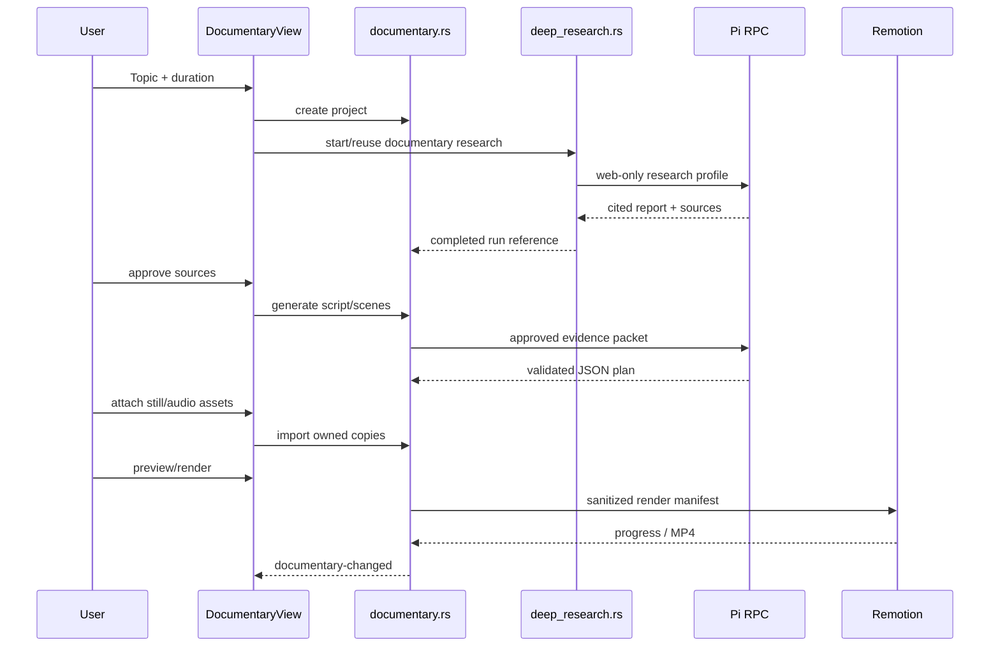
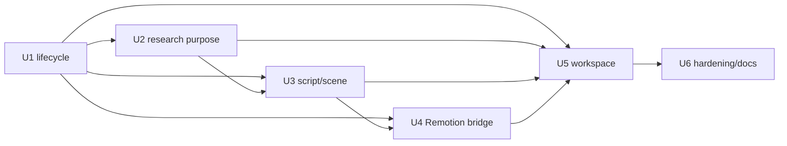

# feat: Add researched Remotion documentary workflow

## Overview

Add a global Documentary workspace that turns a selected topic into a source-backed documentary package and a locally rendered MP4. It reuses Deep Research for web evidence and Pi for writing; it uses Remotion for deterministic preview/rendering. It does not integrate Flow or any AI video-generation provider.

The v1 path is:

```text
Topic + duration
  → Deep Research evidence packet
  → user source review
  → cited narration + claims
  → editable scene plan
  → manually supplied still assets/audio
  → Remotion preview + local MP4
```

## Problem Frame

The app already produces durable, cited web research but stops at a Markdown report. Documentary creation needs a trustworthy bridge from evidence to narration, an auditable scene plan, and repeatable local rendering. Direct prompt-to-video generation is intentionally excluded: it is non-deterministic, external-provider-dependent, and does not preserve a reviewable claim-to-source trail.

## Requirements Trace

- **R1.** User can create a documentary project from a topic and one supported duration: 1, 5, 8, 12, or 20 minutes.
- **R2.** Research runs in the existing isolated web-only Deep Research boundary and stores source metadata; no project files, shell, or write tools reach Pi.
- **R3.** Script claims link to resolvable research sources and expose `verified`, `contextual`, or `uncertain` status.
- **R4.** The user must approve the evidence packet before script/scene generation and can block or remove a source.
- **R5.** The generated script is split into ordered scenes with narration, claim references, editorial title, visual metaphor, image brief, and duration.
- **R6.** Asset input is manual in v1: attach local still images and optional narration/SFX files to scenes. No image, voice, music, or video-generation API.
- **R7.** A bundled Remotion project previews the scene plan and renders an MP4 locally with progress, cancellation, output path, and recoverable failure state.
- **R8.** Rendering preserves a restricted paper-collage documentary language: deterministic layer reveals, readable captions, restrained transitions, and reduced motion.
- **R9.** A documentary project persists independently of Pi transcripts; reopening the app restores research linkage, edits, asset paths, and render history.
- **R10.** No Flow integration, cloud render, provider credentials, automatic publishing, or generated footage in v1.

## Scope Boundaries

### Included

- Global Documentary dashboard beside Deep Research.
- Single-documentary lifecycle: brief, evidence, script, scenes, assets, preview, render.
- Reuse of a completed Deep Research run or creation of a purpose-specific one.
- Claim/source provenance in UI and exportable project JSON.
- One desktop-local Remotion renderer process at a time.
- 16:9, 1080p, 30 fps MP4 as the only v1 output preset.

### Excluded

- Flow, Veo, Sora, Runway, or any direct generative-video integration.
- Automatic image generation, text-to-speech, music generation, stock-media search/licensing, or upload hosting.
- Multi-user collaboration, cloud sync/render, timeline editor, arbitrary templates, social publishing, and mobile support.
- One-image-per-sentence by default. V1 plans scenes by editorial beat; offer sentence splitting only as an explicit generation mode because long scripts otherwise create hundreds of scenes.
- A Rust-owned LLM/research engine. Pi remains the existing research/writing authority.

## Existing Patterns to Reuse

| Concern | Existing reference | Planned reuse |
|---|---|---|
| Durable job lifecycle | `src-tauri/src/deep_research.rs` | Versioned JSON snapshots, atomic write/backup, state transitions, app events, active-run registry, cancellation/recovery. |
| Web isolation | `src-tauri/src/deep_research.rs`, `src-tauri/src/pi_rpc.rs` | Exact web-only tool allowlist and app-owned global cwd. |
| Dashboard routing | `src/App.tsx` | Lazy global view, sidebar entry, event-driven/persisted reload. |
| Accessible dialogs | `src/components/useModalFocus.ts` | Asset replacement/delete/render confirmation focus behavior. |
| Markdown/source rendering | `src/components/DeepResearchView.tsx`, `src/components/MarkdownMessage.tsx` | Report display, external links, cited-source presentation. |
| Local process lifecycle | `src-tauri/src/dev_runner.rs` | Process record/liveness/cancellation patterns, not its project dependency installer. |

## Key Decisions

| Decision | Choice | Rationale |
|---|---|---|
| Research integration | Link each documentary to one Deep Research run; create one tailored run when absent | Reuses durable cited evidence; avoids copying a second research system. |
| Evidence gate | Explicit human approval before Pi writes narration | LLM prose cannot make a claim factual. Review source quality before it becomes a script. |
| Writing engine | A second Pi RPC prompt constrained to an approved evidence packet | Keeps script/scene creation in existing model/auth infrastructure. The packet is untrusted reference content and prompt-delimited like current research handoff. |
| Provenance | Stable claim IDs reference a stored evidence snapshot, not only source URLs | Keeps a script auditable even if the original research run is later deleted or URLs change. |
| Scene granularity | Editorial beats default; sentence mode optional | Produces workable scene counts and avoids needless assets/renders. |
| Asset strategy | File paths chosen with native dialog, copied into app-owned documentary asset directory | Rendering stays reproducible when original files move; do not store raw binaries in run JSON. |
| Video engine | Bundled workspace-local Remotion project, `@remotion/renderer` spawned by Rust | React code owns composition; Rust only validates/lifecycle-manages the renderer. Official Remotion docs support local rendering via renderer/CLI and React preview through Player. |
| Preview | `@remotion/player` in the Tauri React UI | Same `DocumentaryComposition` and JSON props as renderer, reducing preview/render drift. |
| Render format | Fixed 1920×1080, 30fps H.264 MP4 | One tested product path. Add presets only after demand. |
| Concurrency | One local render globally | Simple CPU/RAM bound with unambiguous cancellation. |

## Data Contracts

Persist project records under the app configuration directory, separate from Deep Research:

```text
Application Support/command-rdev-center/documentaries/
  projects/<documentary-id>.json
  assets/<documentary-id>/<stable-asset-name>
  renders/<documentary-id>/<render-id>.mp4
```

```ts
type SourceSnapshot = {
  id: string;
  url: string;
  canonicalUrl: string;
  title: string;
  cited: boolean;
  approved: boolean;
};

type Claim = {
  id: string;
  text: string;
  sourceIds: string[];
  status: "verified" | "contextual" | "uncertain";
};

type Scene = {
  id: string;
  order: number;
  narration: string;
  claimIds: string[];
  editorialTitle: string;
  visualMetaphor: string;
  imageBrief: string;
  durationFrames: number;
  stillAssetId?: string;
  narrationAssetId?: string;
  sfxAssetIds: string[];
};

type DocumentaryProject = {
  version: 1;
  id: string;
  topic: string;
  durationMinutes: 1 | 5 | 8 | 12 | 20;
  state: "brief" | "researching" | "reviewing_sources" | "writing" | "editing" | "ready_to_render" | "rendering" | "completed" | "failed";
  researchRunId?: string;
  sources: SourceSnapshot[];
  script?: { title: string; narration: string; claims: Claim[] };
  scenes: Scene[];
  assets: Asset[];
  renders: RenderRecord[];
};
```

`Asset` records use generated IDs, app-owned copied file paths, MIME/kind, and original display name. `RenderRecord` stores immutable input revision/hash, started/finished timestamps, output file path, state, and a bounded error. Source snapshots and scenes are bounded to prevent unbounded local state.

The renderer receives a sanitized, file-path-resolved render manifest rather than the full persisted project. Validate every asset resolves under the documentary asset directory before passing it to Remotion.

## Pi Procedures

### Research prompt

Extend the existing Deep Research prompt with a `documentary` purpose/profile rather than weakening the default report contract. It must collect a chronology, high-value verified claims, caveats, source URLs, visualizable concepts, and contradictory/uncertain points. Its final structured section is parsed into the evidence packet; normal Markdown remains viewable.

### Script/scene prompt

Use a dedicated Pi session with only the approved `SourceSnapshot[]` and evidence summary. Require strict JSON matching the `Script`/`Claim`/`Scene` contract. The prompt must:

- not add statistics, dates, quotations, or causality without source IDs;
- label uncertain interpretation as `uncertain`;
- use simple English narration for the selected duration;
- make scene titles, metaphors, and image briefs consistent with the paper-collage template;
- target beat-level scenes by default;
- allocate scene frame counts that sum to the chosen duration at 30 fps.

Reject malformed JSON, unknown source IDs, empty narration, unsupported claim state, duplicate/non-contiguous scene order, and a frame total outside a small defined tolerance. Return a repair request to Pi containing only contract-validation errors; do not silently invent/fix claims in Rust.

## High-Level Architecture



## Implementation Units

### U1. Documentary persistence and lifecycle

**Files**
- Add: `src-tauri/src/documentary.rs`
- Modify: `src-tauri/src/lib.rs`
- Test: `src-tauri/src/documentary.rs`

**Work**
- Define versioned project, source snapshot, claim, scene, asset, render, state, and progress structs.
- Implement app-owned project/assets/renders directories and atomic per-project snapshots using Deep Research's proven pattern.
- Add narrow commands: create/list/get/update project; approve sources; delete project; cancel render; import asset; start render.
- Enforce one active research/write/render operation per documentary and one render globally. First terminal state wins.
- Emit `documentary-changed` only after durable mutation.

**Tests**
- Atomic snapshot/backup recovery; one corrupt project does not block library load.
- State transition rejection/idempotency.
- Snapshot source immutability after research import.
- Asset path traversal/outside-directory rejection.
- Render cancellation and late process exit cannot overwrite completed/cancelled state.

### U2. Purpose-specific Deep Research handoff

**Files**
- Modify: `src-tauri/src/deep_research.rs`
- Modify: `src/lib/deep-research.ts`
- Test: `src-tauri/src/deep_research.rs`

**Work**
- Add an optional, explicit research purpose (`report` default, `documentary_evidence`) to `StartInput` and persisted run metadata.
- Preserve the existing four-tool restriction and standard Deep Research behavior.
- Add documentary evidence prompt/profile and a command to copy a completed run's bounded sources/report summary into a documentary project snapshot.
- Do not require a new raw-response database or change normal report handoff behavior.

**Tests**
- Default research prompt/allowlist unchanged.
- Documentary prompt requests chronology, claim-level evidence, caveats, and source URLs.
- Only completed runs with sources can seed a documentary.
- Reusing/deleting a research run cannot mutate the documentary snapshot.

### U3. Script and scene-plan generation

**Files**
- Modify: `src-tauri/src/documentary.rs`
- Modify: `src-tauri/src/pi_rpc.rs`
- Test: `src-tauri/src/documentary.rs`

**Work**
- Reuse Pi RPC process/session primitives with a dedicated internal writing profile. It receives no filesystem, shell, project context, or mutation tools.
- Build a bounded approved-evidence prompt and collect structured JSON output.
- Validate every claim/source/scene relationship before commit; run bounded repair once for format/contract errors.
- Support a user-selected beat mode or sentence mode. Store only validated scene plans.

**Tests**
- Unknown/unapproved source IDs rejected.
- Claims missing sources must be `uncertain` and visibly marked.
- Scene frame totals and order validation.
- Repair only gets validation errors; invalid second result leaves old plan unchanged.
- Existing chat and Deep Research spawn arguments remain unchanged.

### U4. Remotion project and render bridge

**Files**
- Add: `remotion/package.json`
- Add: `remotion/src/index.ts`
- Add: `remotion/src/Root.tsx`
- Add: `remotion/src/DocumentaryComposition.tsx`
- Add: `remotion/src/components/Scene.tsx`
- Add: `remotion/src/components/Captions.tsx`
- Add: `remotion/src/components/Transition.tsx`
- Add: `remotion/src/types.ts`
- Modify: `package.json`
- Modify: `src-tauri/src/documentary.rs`
- Test: `remotion/src/DocumentaryComposition.test.tsx`
- Test: `src-tauri/src/documentary.rs`

**Work**
- Keep Remotion isolated in its own workspace/package; add only `remotion`, `@remotion/player`, and `@remotion/renderer` at one pinned compatible version.
- Define a single 1920×1080/30fps composition receiving render manifest props.
- Build deterministic background, title, still image, caption, optional audio/SFX, paper-layer entrance, and constrained scene transition components. Honor `prefers-reduced-motion` in preview; render uses the restrained default.
- Use one Rust-owned child process to invoke the Remotion renderer; pass manifest via temporary file, parse structured progress, bound logs, cancel process group, then atomically move MP4 into the app-owned render directory.
- Check renderer availability/version and give an actionable install failure. Never run arbitrary user-entered commands.

**Tests**
- Composition duration equals sum of scene frames.
- Missing still shows a deterministic placeholder and blocks final render unless user explicitly enables draft render.
- Captions map to scene narration; no overlap at boundaries.
- Manifest rejects non-owned paths and unknown asset types.
- Renderer process success/failure/cancel state reduction.

### U5. Documentary workspace and review UX

**Files**
- Add: `src/components/DocumentaryView.tsx`
- Add: `src/components/DocumentaryView.test.tsx`
- Add: `src/lib/documentary.ts`
- Add: `src/lib/documentary.test.ts`
- Modify: `src/App.tsx`
- Modify: `src/App.css`

**Work**
- Add lazy-loaded **Documentary** global navigation and project library.
- Wizard states: brief → evidence review → script/scene editor → assets → preview/render → exports.
- Evidence table exposes source URL/title/cited status, approval toggle, source count, and all scene claims. Block generation until at least one source is approved.
- Script/scene editor makes narration, title, visual metaphor, image brief, and claim links reviewable/editable. Manual edits must retain valid claim references or mark text `uncertain`.
- Use native file selection for assets, show import/copy result, and expose missing-asset state before render.
- Embed `@remotion/player` for preview. Use accessible labels, keyboard controls, focus-managed destructive dialogs, textual progress, and error/retry state.

**Tests**
- Empty topic/duration/source approval validation.
- Source approval gates generation.
- Claim status and source links render for every scene.
- Missing assets block final render; preview stays usable.
- Render progress/completion/failure/cancel UI states and restored persisted project.

### U6. Integration hardening and documentation

**Files**
- Modify: `README.md`
- Modify: `docs/PRD.md`
- Add: `docs/adr/0006-documentary-research-remotion-local-rendering.md`
- Modify: `src-tauri/Cargo.toml` only if a minimal existing-stdlib approach is impossible

**Work**
- Document the deterministic/local boundary, source review gate, data locations, supported asset formats, renderer prerequisites, and no-Flow decision.
- Record the architecture decision: Pi researches/writes, users approve evidence/assets, Remotion composes/renders, and Rust manages durable lifecycle.
- Add launch-time reconciliation for interrupted writing/rendering; never claim an old PID/process is live without command verification.
- Keep external dependencies minimum; do not add a database, job queue, media server, or cloud API.

**Tests**
- Typecheck, frontend unit suite, Rust test suite, and a fixture manifest renderer smoke test.
- Manual acceptance: create a 1-minute project, approve sources, edit a scene, import a still and audio file, preview, render MP4, restart app, reopen output/history.

## Dependency Sequence



Implement U1 first. U2/U3 then establish the validated content contract. U4 may begin once the contract is stable. U5 consumes all commands/contracts. U6 is last.

## Video Workflow Learnings Incorporated

The referenced tutorial, **How I Made a Viral Reel Using Claude Code & Remotion**, confirms the planned boundary and adds several implementation details worth adopting:

| Tutorial practice | Adopt for this product | MVP decision |
|---|---|---|
| Voice-over before storyboard | Make narration/script the timing authority; scenes derive from voice beats, not image count | Required. Scene durations use frame counts at 30 fps; imported narration can later refine the timing. |
| 5–6 short voice lines for a 25–30 second reel | Give the scene planner a target beat length and a scene-count budget | Required for a new **vertical reel** preset: 6 beats × roughly 5 seconds. Keep the planned 16:9 documentary preset separate. |
| Scene choreography and asset sheet after voice lines | Extend `Scene` with `onScreenText`, `emotionalBeat`, `signatureAnimation`, and a structured `AssetNeed[]` list | Required. This is more actionable than an image prompt alone. |
| Build scenes independently, then combine a master timeline | One isolated scene component per scene plus one composition that sequences them | Required. A scene-local fix must not change other scene timing/layout. |
| Reusable motion helpers | Shared Remotion engine: `entrance`, `drift`, `boil`, `pingPong`, and frame-window interpolation | Required, but helpers are bounded and opt-in; no generic freeform animation scripting in v1. |
| Shared film treatment wrapper | Shared `Treatment` component with toggled paper grain, halftone, vignette, grade, and scan-line layers | Required. Adapt effects to the planned paper-collage style; keep defaults restrained. |
| Frame-number feedback | Preview exposes current frame, scene frame range, and editable animation cues with `startFrame`/`endFrame` | Required. Store frames, not ambiguous seconds. |
| Background/foreground/character asset layers | Asset sheet classifies each asset by `background`, `subject`, `prop`, `overlay`, `audio`, or `sfx` | Required. Limit v1 scene layers to one background, one subject, and up to three supporting layers. |
| Micro-motion and parallax | Support only declared scene cues: subtle drift/boil, paper entrance, parallax, shadow projection, light flicker, and particle/smoke overlay | Required as a fixed cue vocabulary. The original playbook's locked-layout rule remains: no post-entry drifting except declared micro-motion. |
| Audio as a final but essential pass | Include imported narration, music, and SFX tracks in the render manifest; duck music under narration | Narration required for final render; music/SFX optional. Do not add ElevenLabs in v1. |

### Contract additions

```ts
type AssetNeed = {
  id: string;
  kind: "background" | "subject" | "prop" | "overlay" | "audio" | "sfx";
  description: string;
  required: boolean;
};

type MotionCue = {
  kind: "paper_entrance" | "drift" | "boil" | "parallax" | "shadow" | "flicker" | "particles";
  startFrame: number;
  endFrame: number;
  intensity: "subtle" | "medium";
};

// Extend Scene
onScreenText: string[];
emotionalBeat: string;
signatureAnimation: string;
assetNeeds: AssetNeed[];
motionCues: MotionCue[];
```

### U4 and U5 amendments

- Add `remotion/src/engine/motion.ts` and `remotion/src/components/Treatment.tsx`; scene components consume their bounded helpers and treatment props.
- Render `Scene[]` via a master `DocumentaryComposition`; maintain an independently previewable scene composition for diagnosis.
- Add a second fixed output preset: **vertical reel** (`1080×1920`, 30 fps, 25–60 seconds). Do not make dimensions arbitrary.
- Add timeline inspection in `DocumentaryView`: current frame, cue frame range, source/narration mapping, asset needs, and scene-local preview.
- Add audio ducking tests plus frame-boundary tests for cue timing and scene composition isolation.

## Risks and Mitigations

| Risk | Mitigation |
|---|---|
| Research report contains citations but not machine-linkable claims | Documentary evidence profile plus explicit human approval; script validator rejects unknown source references. |
| Hallucinated or misleading narration | Claim-source mapping, visible uncertainty label, user approval gate. Do not market output as fact-checked journalism. |
| Long durations cause asset/scene explosion | Beat mode default; cap scene count and provide sentence mode only deliberately. Start MVP validation with 1 minute. |
| Renderer toolchain/Chromium differs by OS | Pin compatible Remotion packages, renderer preflight, fixture smoke test, actionable diagnostics. |
| Asset files move or are deleted | Copy approved imports into app-owned assets; reject paths outside ownership at rendering. |
| Local render consumes CPU/RAM | One global render, cancellation, no background queue, visible process state. |
| Preview differs from final render | Same composition and manifest contract for Player and renderer; regression fixture. |
| Deep Research changes regress normal research | Default `report` purpose and existing prompt/allowlist tests remain unchanged. |

## Success Criteria

- User can create a 1-minute documentary from a topic using Deep Research sources, approve evidence, generate a cited script/scene plan, attach assets, preview, and render a valid local MP4.
- Every non-uncertain script claim resolves to one or more approved source snapshots in the UI and exported JSON.
- Normal Deep Research remains web-only and passes its existing test suite unchanged.
- Rerendering an unchanged project produces the same composition/timing and does not call any external video-generation provider.
- Interrupted app/process operations recover as explicit retryable state without losing completed research, plans, assets, or prior renders.

## Open Execution-Time Questions

- Confirm Remotion's current desktop-compatible package/version matrix and Chromium/FFmpeg footprint before pinning packages.
- Decide the minimal supported imported media formats after testing macOS and Windows packaging.
- Determine whether initial voice-over is recorded/imported only or whether a future separate local TTS integration is justified; it is out of scope for this plan.
